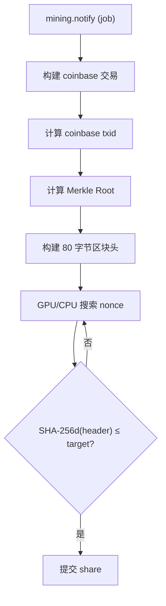
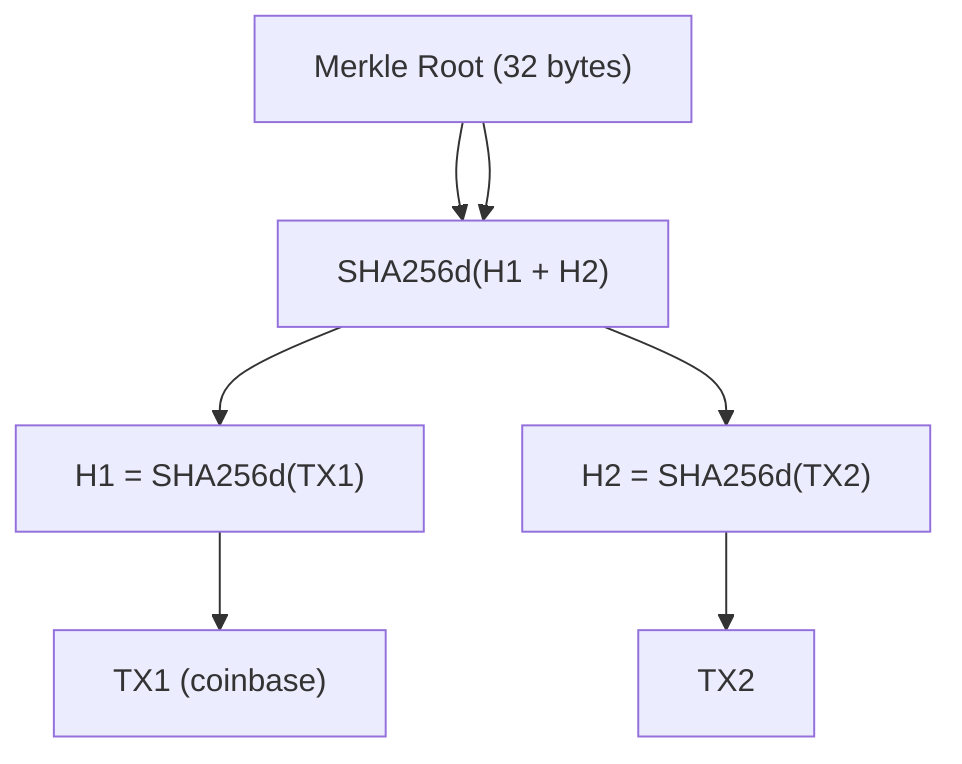
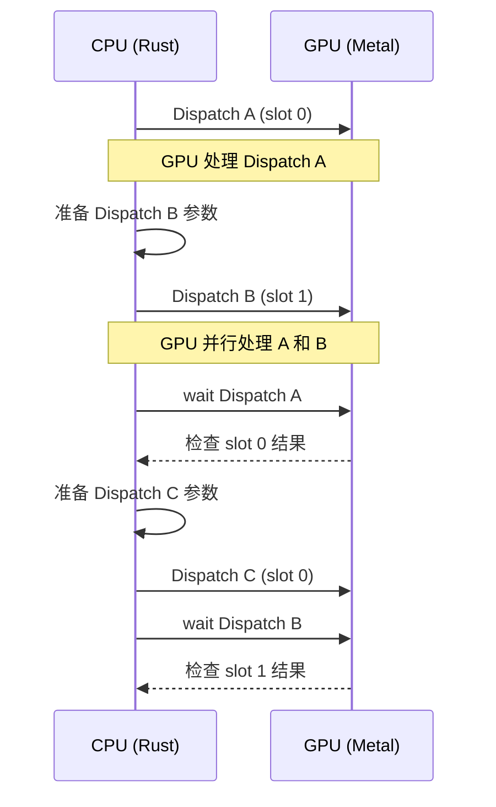

# SHA-256d 挖矿核心算法详解

## 概述

Bitcoin 挖矿的本质是找到一个 nonce（32 位整数），使得区块头的双 SHA-256 哈希值小于目标值（target）。本文档详细解释从 Stratum 作业到提交 share 的完整算法流程。

## 整体流程



## 第一步：构建 Coinbase 交易

Coinbase 是每个区块的第一笔交易，矿工通过它获得区块奖励。

```
coinbase = coinb1 + extranonce1 + extranonce2 + coinb2
```

| 组成部分 | 来源 | 说明 |
|----------|------|------|
| `coinb1` | mining.notify params[2] | coinbase 交易的前半部分 (hex) |
| `extranonce1` | mining.subscribe 响应 | 矿池分配的连接唯一前缀 (hex) |
| `extranonce2` | 矿工本地递增 | 每次搜索 pass 自增，LE 编码后 hex |
| `coinb2` | mining.notify params[3] | coinbase 交易的后半部分 (hex) |

**为什么需要 extranonce？**

矿池同时给成千上万个矿工发送相同的区块模板。如果所有矿工都用相同的 coinbase，那么：
1. 多个矿工可能提交相同的 share（浪费算力）
2. 矿池无法区分不同矿工的贡献

extranonce1 保证每个连接的唯一性，extranonce2 让同一连接的不同搜索 pass 产生不同的 coinbase。

## 第二步：计算 Merkle Root

Merkle Root 是区块中所有交易的哈希树根，用于将交易摘要压缩为 32 字节。

```
coinbase_txid = SHA256d(coinbase)

root = coinbase_txid
for each branch in merkle_branch:
    root = SHA256d(root + branch)

merkle_root = root
```

**Merkle 树原理：**



矿池在 `mining.notify` 中提供 `merkle_branch`，矿工只需将自己的 coinbase txid 与这些 branch 逐级哈希即可得到 merkle root，无需下载完整交易列表。

## 第三步：构建 80 字节区块头

Bitcoin 区块头固定 80 字节，结构如下：

```
偏移  长度  字段          字节序
──────────────────────────────────
 0     4    version        LE
 4    32    prev_hash      每 4 字节 word 内部 LE
36    32    merkle_root    内部字节序（SHA256d 原始输出）
68     4    ntime          LE
72     4    nbits          LE
76     4    nonce          LE
```

### prev_hash 字节序陷阱

Stratum 协议发送的 `prev_hash` 是 Bitcoin 标准的 hex 字符串，其中每 4 字节 word 是 big-endian 的。放入区块头时需要**每 4 字节 word 内部反转**：

```
Stratum hex: "11223344 55667788 ..."
             word0 BE  word1 BE

解码后 bytes: [0x11,0x22,0x33,0x44, 0x55,0x66,0x77,0x88, ...]

区块头需要:   [0x44,0x33,0x22,0x11, 0x88,0x77,0x66,0x55, ...]
              word0 LE           word1 LE
```

**错误做法**：整个 32 字节完全反转 `[31-i]` — 这会导致区块头无效，所有 share 被拒绝。

### ntime bump

矿池提供的 `ntime` 可能略早于矿工本地时钟。矿工应使用 `max(job_ntime, local_time)`，矿池允许在合理范围内这样做。

## 第四步：SHA-256d 哈希

Bitcoin 使用 **双 SHA-256**（SHA-256d）：

```
SHA256d(data) = SHA256(SHA256(data))
```

### SHA-256 算法原理

SHA-256 将输入数据分成 64 字节的块（chunk），逐块处理。

**80 字节区块头被分成两个块：**

```
chunk1 (64 bytes): version(4) + prev_hash(32) + merkle_root[0..28]
chunk2 (16 bytes): merkle_root[28..32] + ntime(4) + nbits(4) + nonce(4)
```

**第一轮 SHA-256：**

```
H1 = SHA256(chunk1 + chunk2)
   = SHA256_compress(chunk2, SHA256_compress(chunk1, IV))
```

其中 IV 是 SHA-256 的初始向量：
```
H0 = [0x6a09e667, 0xbb67ae85, 0x3c6ef372, 0xa54ff53a,
      0x510e527f, 0x9b05688c, 0x1f83d9ab, 0x5be0cd19]
```

**第二轮 SHA-256：**

```
H2 = SHA256(H1)
```

H2 就是最终的 32 字节哈希值。

### SHA-256 压缩函数

每轮 SHA-256 的核心是 64 轮压缩：

```
初始化 8 个 32 位工作变量 a,b,c,d,e,f,g,h = 当前状态

for i in 0..64:
    S1 = (e rotr 6) ^ (e rotr 11) ^ (e rotr 25)
    ch = (e & f) ^ ((~e) & g)
    t1 = h + S1 + ch + K[i] + W[i]
    S0 = (a rotr 2) ^ (a rotr 13) ^ (a rotr 22)
    maj = (a & b) ^ (a & c) ^ (b & c)
    t2 = S0 + maj

    h = g; g = f; f = e; e = d + t1
    d = c; c = b; b = a; a = t1 + t2

最终状态 += 初始状态
```

其中 K[0..63] 是 SHA-256 标准常数，W[0..63] 是消息扩展字。

## 第五步：GPU Midstate 优化

由于 nonce 只影响 chunk2 的最后 4 字节，chunk1 的 SHA-256 中间状态（midstate）在整个搜索过程中是**不变的**。

### 优化原理

```
传统做法 (每个 nonce):
  SHA256_compress(chunk1, IV) → state1
  SHA256_compress(chunk2, state1) → hash1
  SHA256_compress(hash1, IV) → 最终 hash

Midstate 优化:
  CPU 预计算: midstate = SHA256_compress(chunk1, IV)  ← 只算一次！
  GPU 每个 nonce:
    SHA256_compress(chunk2, midstate) → hash1
    SHA256_compress(hash1, IV) → 最终 hash
```

**性能提升**：省去每个 nonce 的 chunk1 压缩（64 轮 SHA-256），GPU 只需处理 chunk2 的压缩 + 第二轮哈希。理论加速约 50%。

### GPU 数据布局

CPU 向 GPU 传递三个 buffer：

| Buffer | 大小 | 内容 |
|--------|------|------|
| `midstate` | 32 bytes (8 × u32) | chunk1 压缩后的 8 个状态字 |
| `tail_words` | 12 bytes (3 × u32) | chunk2 前 12 字节的 BE u32 表示 |
| `target_be` | 32 bytes (8 × u32) | 目标值的 BE u32 数组 |

GPU kernel 中每个线程：
```metal
w[0] = tail_words[0];   // merkle_root[28..32] as BE u32
w[1] = tail_words[1];   // ntime as BE u32
w[2] = tail_words[2];   // nbits as BE u32
w[3] = bswap32(nonce);  // nonce LE → BE
w[4] = 0x80000000;      // SHA-256 padding
...
w[15] = 640;            // 80 bytes × 8 bits
```

## 第六步：难度比较

### Display Hash

Bitcoin 的 "display hash" 是 SHA-256d 输出的**字节反转**：

```
raw_hash = SHA256d(header)     // 自然字节序
display_hash = raw_hash[::-1]  // 字节反转（大端显示）
```

例如：
```
raw_hash:     00000000000000000009519b09dab9caeb1a5049bb58fd...
display_hash: ...fd58bb49501aebcab9da09519b09000000000000000000
```

**比较规则**：将 display hash 作为 256 位大端整数，与 target 比较：

```
display_hash ≤ target → share 有效！
display_hash > target → 继续搜索
```

### Target 计算

```
DIFF1_TARGET = 0x00000000FFFF0000000000000000000000000000000000000000000000000000
share_target = DIFF1_TARGET / difficulty
```

难度 16 的 target：
```
0x000000000FFF0000000000000000000000000000000000000000000000000000
```

## 第七步：双缓冲 GPU 流水线

为了最大化 GPU 利用率，使用双缓冲（ping-pong）技术：



两个 MTLCommandBuffer 交替使用，GPU 处理当前 dispatch 时 CPU 准备下一个，消除空闲等待。

## 完整数据流

```mermaid
flowchart LR
    subgraph Stratum
        J["mining.notify job"]
    end

    subgraph CPU
        CB["coinbase = coinb1 + ex1 + ex2 + coinb2"]
        TXID["txid = SHA256d(coinbase)"]
        MR["merkle_root = Merkle(txid, branches)"]
        HDR["header = version + prev + merkle_root + ntime + nbits + nonce"]
        MID["midstate = SHA256_compress(chunk1)"]
        TAIL["tail_words = chunk2[0..12] as BE u32"]
    end

    subgraph GPU
        K["每个线程: nonce = start + gid"]
        H1["SHA256_compress(chunk2, midstate)"]
        H2["SHA256_compress(hash1, IV)"]
        CMP["display_hash ≤ target ?"]
    end

    subgraph Submit
        V["CPU 复核: SHA256d(header) ≤ target ?"]
        S["mining.submit"]
    end

    J --> CB --> TXID --> MR --> HDR --> MID --> K --> H1 --> H2 --> CMP
    CMP -->|是| V -->|是| S
    CMP -->|否| K
    TAIL --> K
```

