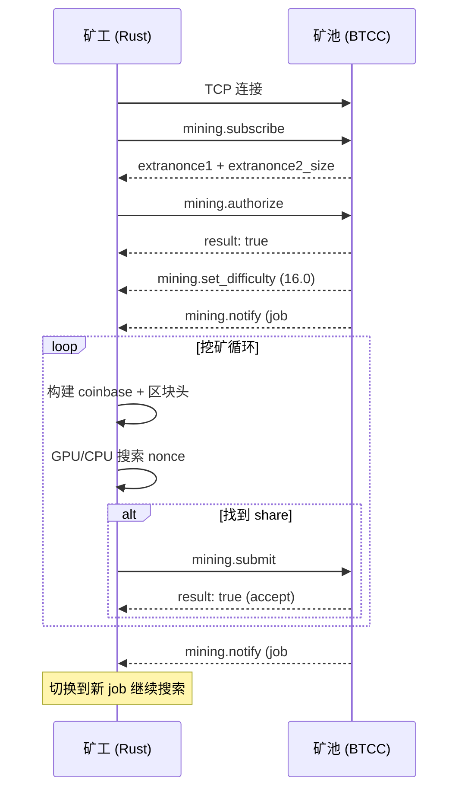

# Stratum 挖矿协议详解

## 概述

Stratum 是目前加密货币矿池最广泛使用的挖矿协议。它基于 TCP + JSON-RPC，替代了已废弃的 GBT (getblocktemplate) 协议，解决了 GBT 协议中矿池带宽消耗大、延迟高的问题。

## 为什么需要矿池协议？

比特币网络中，单个矿工找到区块的概率极低。以 BTCC 为例：

- 网络难度极高，单个 188 MH/s 的矿机找到区块的期望时间以**千年**计
- 矿池将成千上万个矿工的算力聚合，统一分配工作量
- 矿工提交的是**低难度 share**（而非完整区块），矿池根据 share 数量分配收益

## Stratum v1 协议流程

### 1. 建立 TCP 连接

```
矿工 ──TCP connect──► 矿池 (如 pool.btc-classic.org:63101)
```

Stratum 使用长连接 TCP，所有通信都是换行符分隔的 JSON 消息（`\n` 结尾）。

### 2. 订阅挖矿服务 (mining.subscribe)

```json
// 矿工 → 矿池
{"id": 1, "method": "mining.subscribe", "params": ["btcc-rust-miner/0.2.0"]}

// 矿池 → 矿工
{
  "id": 1,
  "result": [
    [["mining.set_difficulty", "..."], ["mining.notify", "..."]],
    "30005acb",  // extranonce1: 矿池分配给此连接的唯一前缀 (hex)
    8            // extranonce2_size: extranonce2 的字节数
  ],
  "error": null
}
```

**关键概念 — extranonce：**

矿池需要确保每个矿工的 coinbase 交易唯一。它通过两级 nonce 实现：

| 字段 | 来源 | 说明 |
|------|------|------|
| `extranonce1` | 矿池在 subscribe 响应中分配 | 每个连接唯一，固定不变 |
| `extranonce2` | 矿工本地递增 | 每次搜索 pass 自增，LE 编码 |

coinbase 交易 = `coinb1 + extranonce1 + extranonce2 + coinb2`

### 3. 授权 (mining.authorize)

```json
// 矿工 → 矿池
{"id": 2, "method": "mining.authorize", "params": ["钱包地址.矿工名", "x"]}

// 矿池 → 矿工
{"id": 2, "result": true, "error": null}
```

用户名格式：`<BTCC地址>.<矿工标识>`，密码通常填 `x` 即可。

### 4. 难度设置 (mining.set_difficulty)

```json
// 矿池 → 矿工 (主动推送)
{"id": null, "method": "mining.set_difficulty", "params": [16.0]}
```

矿池根据矿工算力动态调整 share 难度（vardiff），确保每个矿工大约每 10-30 秒提交一个 share。

### 5. 接收挖矿作业 (mining.notify)

```json
// 矿池 → 矿工 (主动推送)
{
  "id": null,
  "method": "mining.notify",
  "params": [
    "00000eda",                          // job_id
    "7c7f8948...",                       // prev_hash (32 bytes hex)
    "0100000001000000...",               // coinb1 (hex)
    "ffffffff...",                       // coinb2 (hex)
    ["merkle_branch_1", "..."],          // merkle_branch
    "20000000",                          // version (hex)
    "1902ee94",                          // nbits (hex)
    "6655a3b1",                          // ntime (hex)
    true                                 // clean_jobs
  ]
}
```

### 6. 提交 Share (mining.submit)

```json
// 矿工 → 矿池
{
  "id": 101,
  "method": "mining.submit",
  "params": [
    "cc1q...worker1",   // 用户名
    "00000eda",         // job_id
    "0100000000000000", // extranonce2 (hex)
    "6655a3b2",         // ntime (hex)
    "b1defe4d"          // nonce (hex)
  ]
}

// 矿池 → 矿工
{"id": 101, "result": true, "error": null}   // 接受
// 或
{"id": 101, "result": false, "error": [21, "low difficulty share", null]}  // 拒绝
```

## 完整通信时序图



## Share 难度 vs 网络难度

| | 网络难度 (nbits) | Share 难度 (vardiff) |
|------|------|------|
| 来源 | 区块头中的 `nbits` 字段 | 矿池 `mining.set_difficulty` 推送 |
| 用途 | 定义有效区块的 PoW 目标 | 定义有效 share 的提交门槛 |
| 典型值 | ~80 万亿 (1902ee94) | 16 ~ 256 |
| 目标计算 | `nbits_to_target(nbits)` | `DIFF1_TARGET / difficulty` |

**DIFF1_TARGET** = `0x00000000FFFF0000000000000000000000000000000000000000000000000000`

这是 Bitcoin 难度 1 的目标值。Share 难度为 N 时，目标 = DIFF1_TARGET / N。

例如难度 16 的目标：
```
0x000000000FFF0000000000000000000000000000000000000000000000000000
```

## 关键实现细节

### prev_hash 字节序

Stratum 协议发送的 `prev_hash` 是 Bitcoin 标准的 hex 表示。放入区块头时需要**每 4 字节 word 内部反转**，而非整个 32 字节反转：

```
Stratum 发送:  "1122334455667788..." (每 4 字节 word 为 BE)
区块头需要:    [0x44,0x33,0x22,0x11, 0x88,0x77,0x66,0x55, ...]
```

### ntime 时间戳

矿池提供的 `ntime` 可能略早于矿工本地时钟。矿工应使用 `max(job_ntime, local_time)` 来 bump 时间戳，矿池允许在合理范围内这样做。

### extranonce2 编码

extranonce2 在 coinbase 中是原始字节，但在 `mining.submit` 中需要 hex 编码提交。Python 参考实现使用 little-endian 编码：

```rust
let bytes = extranonce2_counter.to_le_bytes();
let extranonce2_hex = hex::encode(bytes);  // 用于 submit
```